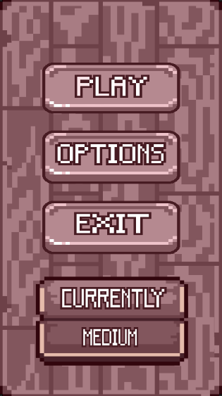
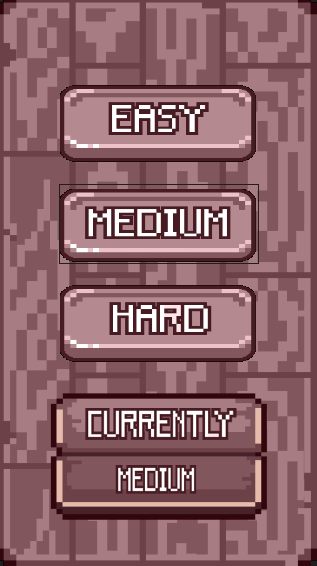

# PopupMiniGames


## Beskrivning

PopupMiniGames är en Windows Forms-baserad applikation som samlar flera minispel i ett gemensamt gränssnitt. Programmet är uppbyggt kring en huvudmeny som laddar grafiska resurser från projektets UI-mapp och visar dem med pixelinspirerad design. Menyn fungerar som navet för applikationen och ger användaren möjlighet att starta spel, ändra svårighetsnivå och avsluta programmet.

Hela systemet är byggt modulärt, vilket innebär att varje minispel är en separat klass som implementerar ett gemensamt interface (IMiniGame). Tack vare detta kan applikationen automatiskt hitta och ladda alla minispel som finns i projektet utan att du behöver skriva extra kod varje gång ett nytt spel läggs till.

Programmet använder en central datastruktur (GameData) för att lagra spelrelaterad information såsom poäng, antal misstag och inställd svårighetsgrad. Dessa data följer med varje minispel och uppdateras automatiskt beroende på spelarens prestation.

När ett minispel körs visas det i ett eget fönster och kör sin egen logik – till exempel tidsbegränsade frågor, hinder som ska undvikas eller slumpmässiga utmaningar. När spelet avslutas (antingen genom vinst eller förlust) skickas resultatet tillbaka till huvudprogrammet via en GameEnded-händelse. På detta sätt hålls huvudprogrammet uppdaterat utan hård koppling mellan komponenterna.

Programmet har också stöd för resursstädning genom interfacet IMiniGameWithCleanup. Det gör att minispel som använder timers, event-händelser eller dynamiskt skapade resurser kan avslutas och rensas korrekt, vilket förhindrar frysningar och minnesläckor.

Applikationen är utvecklad för att köras i Visual Studio och använder standardfunktioner i .NET Windows Forms, kombinerat med egen UI-hantering genom klasser som UIManager, Menu och MenuButton. Detta ger en flexibel struktur där både layout och logik är tydligt uppdelade.

### Krav och förutsättningar

- Windows (WinForms)
- .NET SDK 9 (Target Framework: net9.0-windows)
- Visual Studio eller VS Code med C#-stöd

---

## Projektstruktur

```text
PopupMiniGames/
├─ PopupMiniGames.sln
├─ README.md
├─ OOAD/
│  ├─ OOA.md
│  ├─ OOD.md
│  └─ OOP.md
└─ PopupMiniGames/
  ├─ PopupMiniGames.csproj
  ├─ Program.cs
  ├─ MainForm.cs
  ├─ Difficulty.cs
  ├─ GameData.cs
  ├─ UI/
  │  ├─ UIManager.cs
  │  ├─ Menu.cs
  │  └─ MenuButton.cs
  ├─ UIAssets/
  ├─ GameAssets/
  │  ├─ PolarEngine/
  │  │  ├─ Game.cs
  │  │  ├─ GameObject.cs
  │  │  ├─ Component.cs
  │  │  ├─ Collider.cs
  │  │  ├─ GameRenderer.cs
  │  │  └─ Sprite.cs
  │  ├─ FindMatchImages/
  │  ├─ FlappyKalleAssets/
  │  └─ SkillCheckAssets/
  ├─ MiniGames/
  │  ├─ IMiniGames.cs
  │  ├─ IMiniGameWithCleanup.cs
  │  ├─ CatchTapGame.cs
  │  ├─ ClickTheButtonGame.cs
  │  ├─ CupShuffleGame.cs
  │  ├─ FindMatchGame.cs
  │  ├─ FlappyKalle.cs
  │  ├─ GuessNumberGame.cs
  │  ├─ HangmanGame.cs
  │  ├─ KalleAnkaEscapesGame.cs
  │  ├─ QuickMathGame.cs
  │  └─ SkillCheckGame.cs
  ├─ bin/   (byggutdata)
  └─ obj/   (mellanbuild)
```

## English Summary

PopupMiniGames is a Windows Forms app that bundles multiple mini games behind a simple pixel-inspired menu UI. Each game implements a common `IMiniGame` interface, while shared state such as score and difficulty is handled via `GameData`. Run it with:

```bash
cd PopupMiniGames
dotnet run
```

Or build:

```bash
dotnet build PopupMiniGames/PopupMiniGames.csproj
```

### Huvudmeny

Huvudmenyn innehåller:

- Play – Startar ett slumpmässigt minispel
- Options – Öppnar inställningsmenyn
- Exit – Stänger applikationen
- Längst ned visas alltid den aktuella svårighetsgraden.



### Optionsmeny

Optionsmenyn låter spelaren välja svårighetsgrad:

- Easy
- Medium
- Hard

När spelaren väljer en svårighetsgrad uppdateras den direkt och visas sedan på huvudmenyn.



---

## Funktioner

- **Huvudmeny med grafiskt gränssnitt**  
  Visar bakgrundsbilder och menyknappar (Play, Options, Exit). Hanteras av UIManager och interna UI-komponenter.

- **Dynamisk laddning av minispel**  
  Programmet identifierar automatiskt alla klasser som implementerar `IMiniGame` och kan starta dem utan manuell registrering.

- **Gemensam speldatahantering**  
  `GameData` håller reda på poäng, misstag, svårighetsgrad och andra spelvärden som delas mellan huvudprogrammet och varje minispel.

- **Resultathantering via events**  
  Varje minispel meddelar huvudprogrammet när det avslutas genom `GameEnded`-eventet, vilket gör programmet modulärt och löst kopplat.

- **Stöd för korrekt resursstädning**  
  Minispel som använder timers, eventbindningar eller bilder kan implementera `IMiniGameWithCleanup` för att frigöra resurser och undvika läckor.

- **Flexibelt UI-system**  
  Bakgrundsbilder, knappar och layout hanteras via egna klasser (`Menu`, `MenuButton` m.fl.), vilket gör det enkelt att byta grafik eller utöka gränssnittet.

- **Exempelspel ingår**  
  Projektet innehåller minst ett fullständigt minispel (t.ex. QuickMathGame) som visar hur logik, timer, poängräkning och eventavslutning fungerar.

---

## Hur man lägger till ett nytt minispel

1. Skapa en ny klass i `MiniGames`-namnrymden.
2. Implementera `IMiniGame` (och `IMiniGameWithCleanup` när resurser måste frigöras explicit).

### Viktiga krav för ett minispel

- Public konstruktor som tar `GameData` som parameter, t.ex.: `public MyGame(GameData data)`
- Implementera `void StartGame(Difficulty difficulty)` för att starta spelet.
- Raise eventet `GameEnded` när spelet är klart med relevant `GameResult`.
- Om spelet skapar timers, bilder eller andra resurser, implementera `Cleanup()` i `IMiniGameWithCleanup` och ta bort events/timers/bilder där.

---

## Så här kör du programmet:

```bash
cd PopupMiniGames
dotnet run
```

Alternativt via Visual Studio: öppna lösningen och tryck F5.

Bygga utan att köra:

```bash
dotnet build PopupMiniGames/PopupMiniGames.csproj
```

### Vad användaren gör efter att programmet startar

**Huvudmenyn**

Användaren ser tre alternativ: Play, Options och Exit, samt aktuell svårighetsgrad längst ned.

**Styrning**

- Mus: Klicka på alternativ
- Tangentbord:
  - W / S – Flytta mellan menyval
  - Enter – Välj markerat alternativ
  - Esc – Stänger hela programmet

**Starta ett spel**

- Klicka på Play eller tryck Enter för att starta ett slumpmässigt minispel.
- Följ spelets instruktioner (t.ex. klicka, skriv svar, undvik hinder).
- Spelet visar poäng och antal misstag under spelets gång.
- Resultat efter spelet
- När spelet avslutas visas:
  - Poäng från spelet
  - Om du vann eller förlorade
  - Totalt antal vinster och förluster hittills
- När du når max antal vinster eller förluster får du veta om du har vunnit eller förlorat i PopupMiniGames, och återvänder därefter automatiskt till huvudmenyn.

**Ändra svårighetsgrad**

- Klicka på Options eller välj med Enter.
- Välj mellan Easy, Medium eller Hard.
- Ändringen uppdateras direkt och visas på huvudmenyn.
- Esc – Gå tillbaka till huvudmenyn.

**Avsluta programmet**

Klicka på Exit eller välj med Enter för att stänga applikationen.

---

## Inkluderade minispel

Följande minispel finns i projektet (katalogen PopupMiniGames/MiniGames):

- CatchTapGame
- ClickTheButtonGame
- CupShuffleGame
- FindMatchGame
- FlappyKalle
- GuessNumberGame
- HangmanGame
- KalleAnkaEscapesGame
- QuickMathGame
- SkillCheckGame

Alla minispel implementerar `IMiniGame`, och vissa även `IMiniGameWithCleanup` när resurser behöver städas.

## Licens

Detta projekt använder MIT-licensen. Se [LICENSE](LICENSE).

## Utvecklare

**Alaa Alsous**,**Ida Lindström** och **Sebastian Johansson**  
Språk: C#  
Plattform: .NET 9 / Windows Forms  
Verktyg: Visual Studio, VS code
